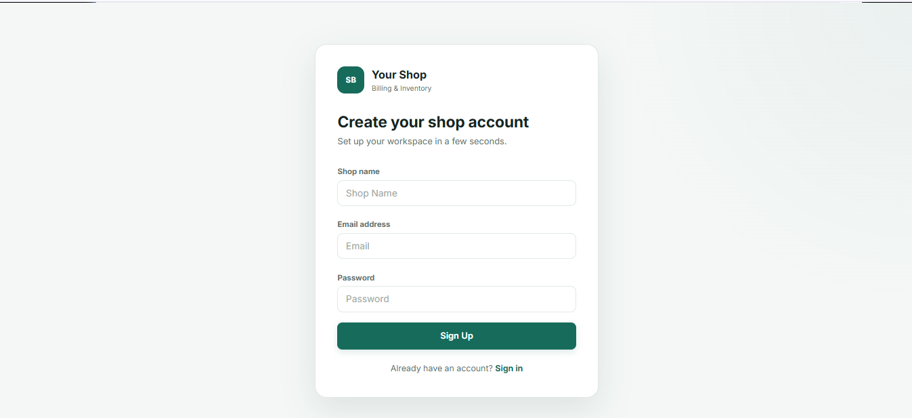
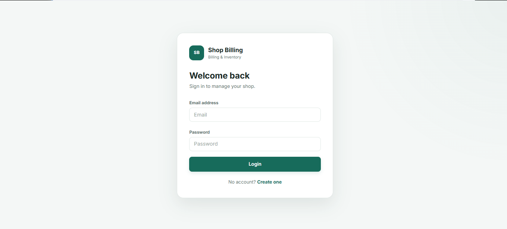
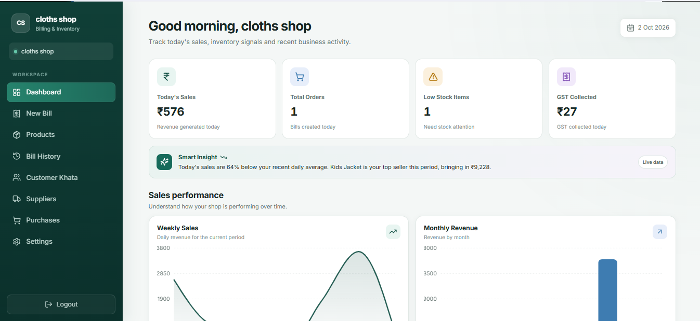
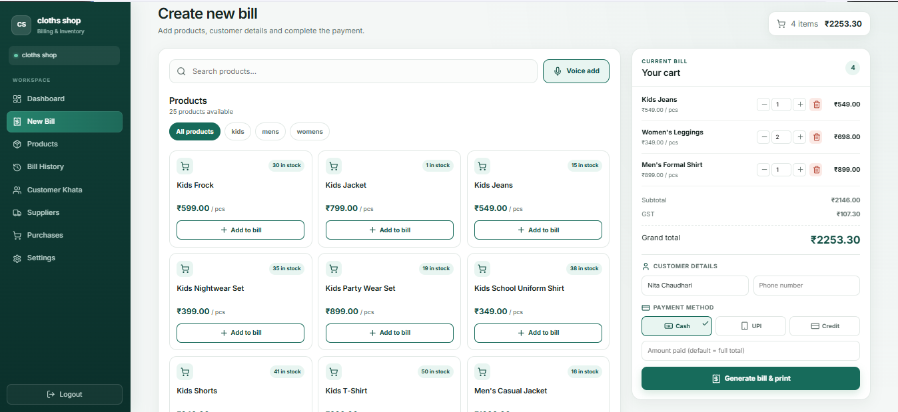
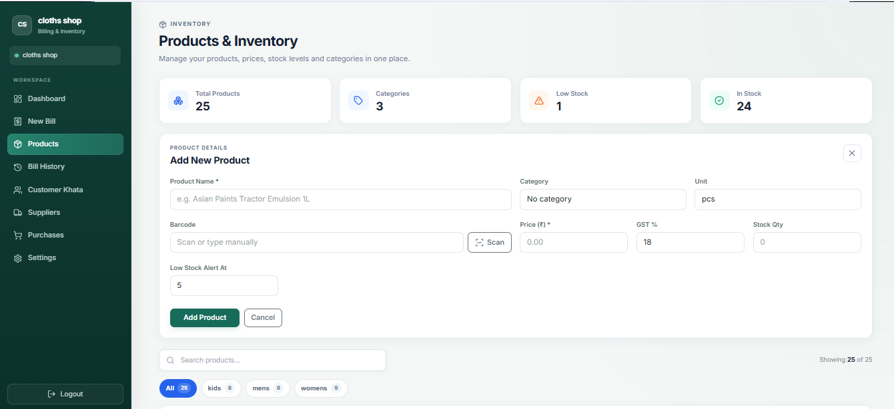
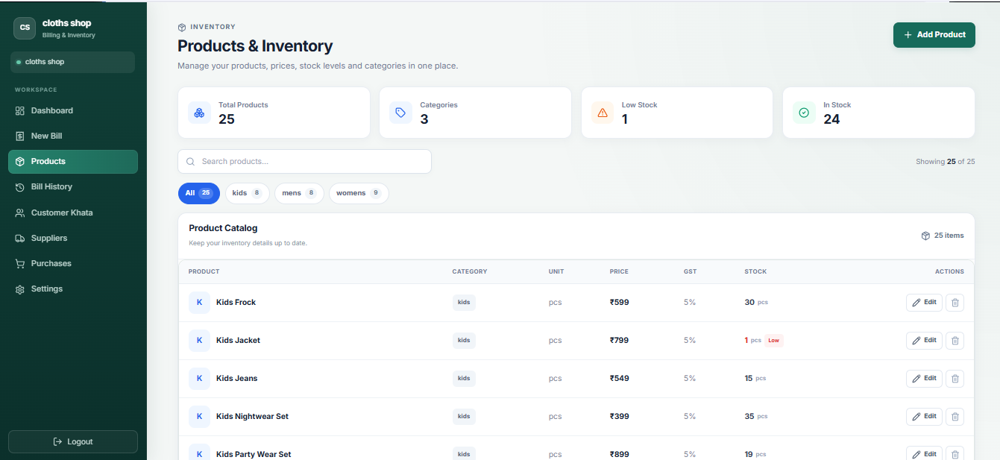
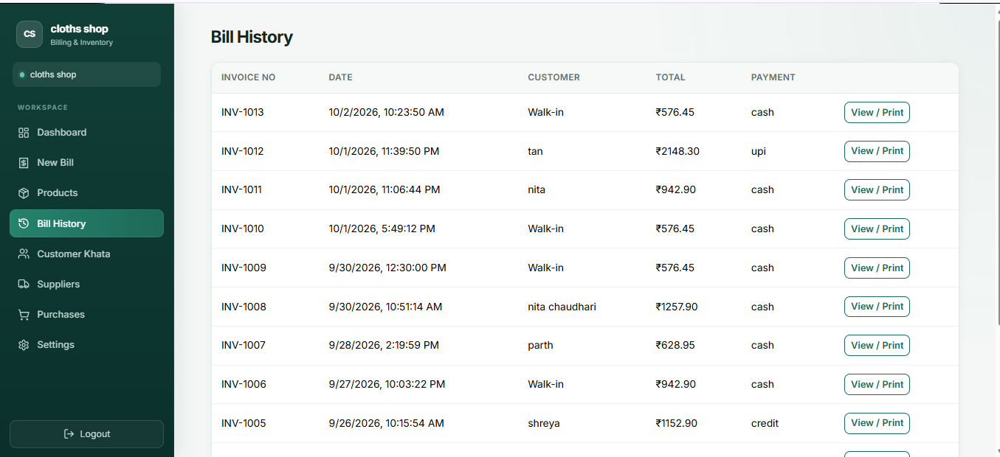
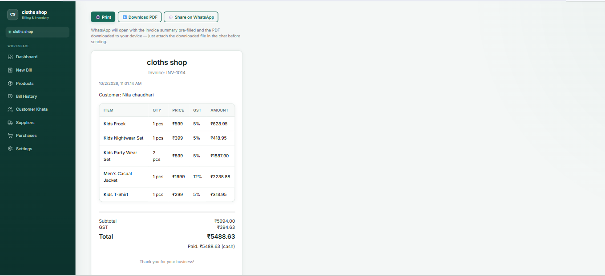
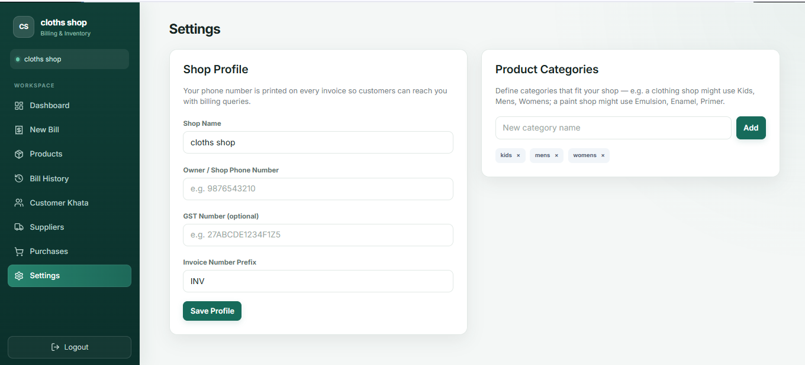

# 🧾 Shop Billing & Inventory Management System

A full-stack **Shop Billing and Inventory Management System** built to simplify daily shop operations such as billing, product management, inventory tracking, customer management, supplier management, purchases, and invoice generation.

The application provides a modern React-based interface connected to a Node.js/Express backend with Prisma and SQLite.

---

## 📸 Application Screenshots

The following screenshots are from the actual working application.

### 🔐 Authentication

#### Sign Up



#### Login



---

## 📊 Dashboard

The dashboard provides an overview of the shop's daily business activity, including sales, orders, low-stock items, GST collected, and sales analytics.



---

## 🧾 Billing

The billing module allows users to search products, add products to the bill, manage quantities, calculate GST, enter customer details, select payment methods, and generate invoices.



### Billing Features

- Product search
- Category filtering
- Add products to bill
- Increase/decrease quantity
- Automatic subtotal calculation
- GST calculation
- Grand total calculation
- Customer details
- Cash / UPI / Credit payment methods
- Voice-assisted billing
- Invoice generation
- Print invoice

---

## 📦 Products & Inventory

### Add Product

Products can be added with important inventory information such as category, unit, barcode, price, GST percentage, stock quantity, and low-stock threshold.



### Product Inventory

The inventory page provides product search, category filtering, stock information, pricing, GST details, and edit/delete actions.



### Inventory Features

- Add products
- Edit products
- Delete products
- Product categories
- Barcode management
- Barcode scanning
- Price management
- GST management
- Stock quantity tracking
- Low-stock alerts
- Product search
- Category filtering

---

## 🧾 Bill History

The Bill History module displays previously generated invoices along with invoice number, date, customer, total amount, and payment method.



---

## 🧾 Invoice

The invoice page displays complete billing information including products, quantities, prices, GST, subtotal, total amount, customer details, and payment information.

It also provides options for printing and downloading the invoice.



---

## ⚙️ Settings

The Settings module allows the shop owner to configure shop information and product categories.



### Settings Features

- Shop name
- Owner / shop phone number
- GST number
- Invoice number prefix
- Product categories
- Shop profile management

---

# ✨ Features

## 🔐 Authentication

- User registration
- User login
- JWT-based authentication
- Protected application routes

## 📊 Dashboard

- Today's sales
- Total orders
- Low-stock products
- GST collected
- Weekly sales chart
- Monthly revenue chart
- Top products
- Category-wise sales

## 🧾 Billing

- Product search
- Category filtering
- Shopping cart
- Quantity management
- GST calculation
- Customer details
- Multiple payment methods
- Voice-assisted billing
- Invoice generation
- Invoice printing

## 📦 Inventory

- Product management
- Category management
- Barcode support
- Camera barcode scanning
- Stock tracking
- Low-stock alerts
- Product search and filtering

## 👥 Customers

- Customer management
- Customer information
- Customer billing information

## 🚚 Suppliers

- Supplier management
- Supplier information
- Supplier records

## 🛒 Purchases

- Purchase management
- Supplier-related purchases
- Inventory updates

## 🧾 Invoice & Bill History

- Previous bill records
- Invoice details
- Print invoice
- Download invoice as PDF

---

# 🛠️ Technology Stack

## Frontend

- **React.js**
- **React Router**
- **Vite**
- **Bootstrap**
- **Axios**
- **Lucide React**
- **Recharts**

## Backend

- **Node.js**
- **Express.js**
- **JWT Authentication**
- **REST APIs**
- **Prisma ORM**

## Database

- **SQLite**
- **Prisma Migrations**

## Development Tools

- **Git**
- **GitHub**
- **VS Code**

---

# 🏗️ Project Architecture

```text
                    ┌──────────────────────┐
                    │        User          │
                    └──────────┬───────────┘
                               │
                               ▼
                    ┌──────────────────────┐
                    │   React Frontend     │
                    │                      │
                    │ Dashboard            │
                    │ Billing              │
                    │ Products             │
                    │ Customers            │
                    │ Suppliers            │
                    │ Purchases            │
                    │ Settings             │
                    └──────────┬───────────┘
                               │
                               │ Axios
                               ▼
                    ┌──────────────────────┐
                    │   Express Backend    │
                    │                      │
                    │ Auth API             │
                    │ Products API         │
                    │ Billing API          │
                    │ Customers API       │
                    │ Suppliers API       │
                    │ Purchases API        │
                    │ Categories API       │
                    └──────────┬───────────┘
                               │
                               ▼
                    ┌──────────────────────┐
                    │     Prisma ORM       │
                    └──────────┬───────────┘
                               │
                               ▼
                    ┌──────────────────────┐
                    │    SQLite Database   │
                    └──────────────────────┘